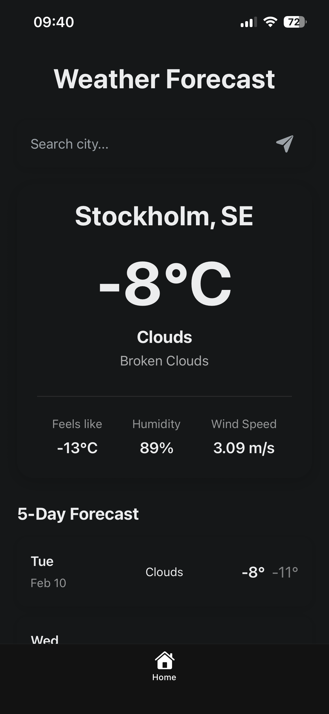

# Weather App 🌤️

A beautiful, cross-platform weather application built with React Native and Expo. Get real-time weather information for your current location or search for any city worldwide.

## Screenshot




## Features

-  **Location-based weather** - Automatically detects your location and displays current weather
-  **City search** - Search for weather in any city around the world
-  **5-day forecast** - View upcoming weather predictions
-  **Dark mode support** - Seamless light and dark theme switching
-  **Cross-platform** - Works on iOS, Android, and web
-  **Pull to refresh** - Update weather data with a simple swipe down

## Tech Stack

- **React Native** - Mobile framework
- **Expo** - Development platform
- **TypeScript** - Type-safe development
- **OpenWeatherMap API** - Weather data provider
- **Expo Location** - GPS and location services

## Getting Started

### Prerequisites

- Node.js (v16 or higher)
- npm or yarn
- Expo Go app (for testing on physical devices)

### Installation

1. **Clone the repository**
   ```bash
   git clone <your-repo-url>
   cd NewNativeTestApp
   ```

2. **Install dependencies**
   ```bash
   npm install
   ```

3. **Set up your API key**
   
   Create a `.env` file in the project root:
   ```
   EXPO_PUBLIC_WEATHER_API_KEY=your_openweathermap_api_key_here
   ```
   
   Get your free API key from [OpenWeatherMap](https://openweathermap.org/api)

4. **Start the app**
   ```bash
   npx expo start
   ```

5. **Run on your device**
   - Scan the QR code with Expo Go (Android) or Camera app (iOS)
   - Or press `a` for Android emulator
   - Or press `i` for iOS simulator
   - Or press `w` for web browser

## Project Structure

```
app/                    # Main application screens
  (tabs)/              # Tab navigation group
    index.tsx          # Home/Weather screen
    explore.tsx        # Info screen
components/            # Reusable UI components
  weather/            # Weather-specific components
    weather-card.tsx   # Current weather display
    search-bar.tsx     # City search input
    forecast-item.tsx  # Forecast day item
hooks/                # Custom React hooks
  use-weather.ts      # Weather data fetching
  use-location.ts     # GPS location handling
services/             # API services
  weather-api.ts      # OpenWeatherMap API calls
types/                # TypeScript type definitions
  weather.ts          # Weather data types
```

## Usage

- **Current Location**: The app automatically requests location permission and displays weather for your area
- **Search**: Type a city name in the search bar and press enter
- **Refresh**: Pull down on the screen to refresh weather data
- **Forecast**: Scroll down to view the 5-day forecast

## API Reference

This app uses the [OpenWeatherMap API](https://openweathermap.org/api):
- Current Weather Data
- 5 Day / 3 Hour Forecast

## License

This project is open source and available under the MIT License.

## Acknowledgments

- Weather data provided by [OpenWeatherMap](https://openweathermap.org/)
- Built with [Expo](https://expo.dev)
